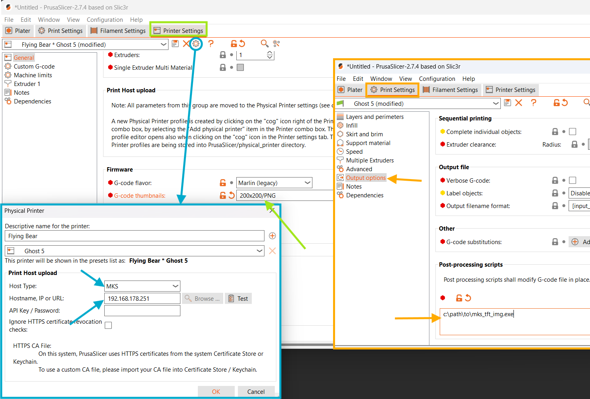

# mks_tft_img

This is a simple command line tool that converts a preview image in G-code to a format supported by printers with MKS TFT35 displays (tested with FlyingBear Ghost 5).
It is designed to be used as a post-processing script in slicers like PrusaSlicer and family (tested in PrusaSlicer and OrcaSlicer).

## Motivation
When using the Cura slicer, the [MKS WiFi plugin](https://github.com/PrintMakerLab/mks-wifi-plugin) allows sending G-code over WiFi and generates preview images for printer screens.
However, PrusaSlicer can send G-code over WiFi but lacks support for MKS TFT35 display image formats. This tool addresses that gap.

I have only tested this tool with my FlyingBear Ghost 5 printer. However, based on the functionality of the Cura plugin, it should work with other printers supported by that plugin, although some may require image formats that are not included here.
While it should be easy to add these formats, I decided not to do so for now due to the lack of testing ability. If you have one of these printers, want to use this tool, and are willing to help with testing, please feel free to open an issue.

## Configuration
1. Download the tool executable from the [Releases](../../releases/) page and unpack it to your preferred location.
2. Configure the following settings in your slicer (the location of the settings may vary depending on the slicer):
   - In printer settings, change the **G-code thumbnails** option to `200x200/PNG`. This tells the slicer to generate a 200x200 PNG image preview and include it in the G-code.
     - Supported image formats are QOI, JPG and PNG. Pick whichever you like, I didn't notice any difference.
     - You can specify different image size, if needed, the tool will resize them when needed. I use 200x200 in my setup because this is the size of the final image used on my printer.
   - Set **Host Type** to `MKS` and specify your printer's IP/Hostname under physical printer settings.
   - In print settings, under **Output** options in the **Post-processing scripts**, add a new line and specify the full path to the tool executable file (from step 1).
    

      
Example configuration in PrusaSlicer

      
      
    

3. If your printer requires different simage and gimage sizes, you can specify them via `--simage-size` (default: 50) and `--gimage-size` (default: 200).

   For example, the Two Trees Sapphire printer's simage size should be 100 and gimage 200. You can set up the post-processing script as one of the following:
   - with explicit simage and gimage: `c:\path\to\mks_tft_img.exe --simage-size 100 --gimage-size 200`
   - only specify simage because the default gimage is ok:  `c:\path\to\mks_tft_img.exe --simage-size 100`
   
## Troubleshooting
If something doesn't work (e.g. the slicer complains that the tool fails, or there is no preview image in the G-code), you can check the log outputs.
There are two ways to do this; use whichever is more convenient for you:
1. Via command line:
   1. Remove the tool from Post-processing scripts.
   2. Save the G-code from your slicer to disk.
   3. Run the tool from a command line and specify the full path to the G-code file as an argument.
   4. The tool will try to convert the image and print logs to `stderr`
2. Via log file
   1. Add the `--log-file` argument to the command line arguments of the tool in Post-processing scripts of your slicer, with the full path to a log file (e.g. `c:\path\to\mks_tft_img.exe --log-file c:\mks_tft_img.log`)
   2. Send your G-code to the printer or save it to trigger the post-processing script.
   3. Check the log file created by this tool at the specified path.

In both cases, you can use `--log-level` to control what is included in the log. For example, `--log-level DEBUG` will include much more detail. The default log level is `WARN`.
